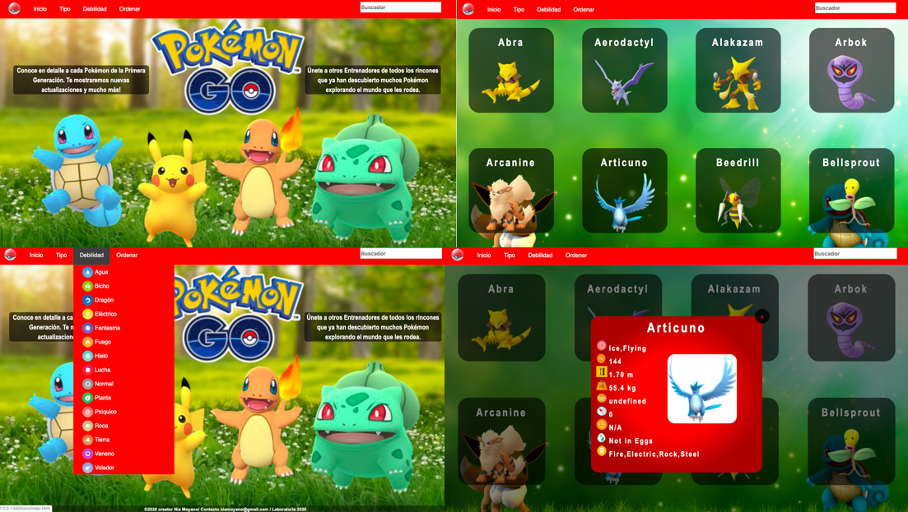
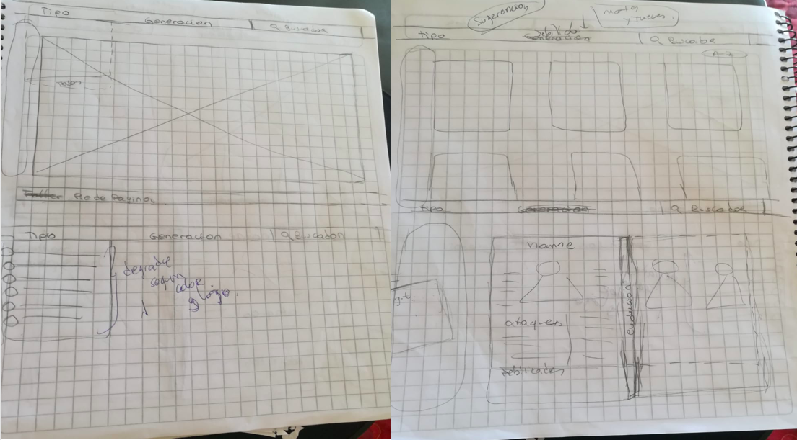
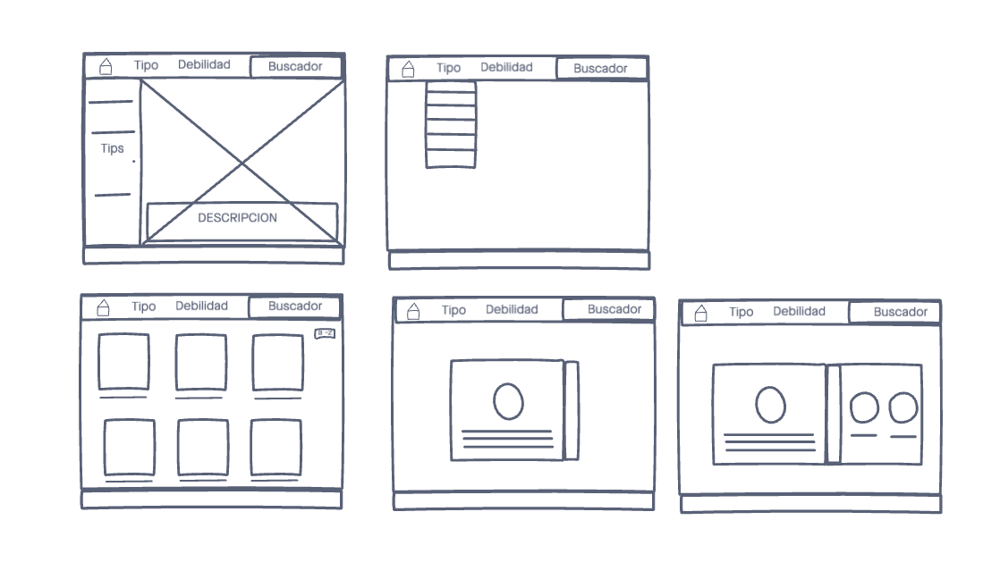
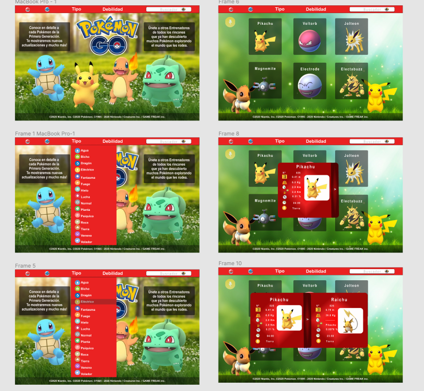

# PROYECT DATA LOVERS

***

## Índice

* 1.Resumen Proyecto
* 2.Presentación
* 3.Investigación UX
* 4.Usuarios

***

# RESUMEN DEL PROYECTO
El proyecto consiste en la construcción de una pagina web que se adapte a diversos formatos de pantallas. El contenido esta basado en el juego Pokemón Go, esta pagina permitirá a lxs usuarixs poder identificar a los pokemones por su tipo, debilidad y ordenarlos alfabéticamente y por número.

# PRESENTACIÓN 
 

***

# INVESTIGACIÓN UX 

 ## PROTOTIPOS 
 
 ### PROTOTIPO IDEA EN PAPEL Y LÁPIZ
 
 ### PROTOTIPO DE BAJA FIDELIDAD
 
 Link InVision: https://nia891374.invisionapp.com/freehand/pokemon-fducJV6wQ?v=Ow%2Be1YqDBIUICAi7%2BiSD2w%3D%3D&linkshare=urlcopied
 ***
 ### PROTOTIPO EN ALTA FIDELIDAD VERSIÓN ESCRITORIO
 
 Link Figma: https://www.figma.com/file/iGVGS4lEmOceArwYGa4ZVf/Final-version?node-id=0%3A1
 ***
 ### PROTOTIPO EN ALTA FIELIDAD VERSIÓN PARA MÓVIL 
 
 Link Figma: https://www.figma.com/file/w6lJ2xLFGXggd86zYh7VRd/Final-Phone?node-id=0%3A1

 ****
 ### TESTEO EN USUARIOS

Se realizó testeo con usuarios entre 10 a 30 años, quienes indican que los colores siguen la identidad gráfica de Pokémon, que es agradable e intuitiva. Como sugerencia nos indicaron cambiar la simbología de la ficha del pokémon o que al pasar el cursor explique que son los símbolos ya que pueden ser poco claros.
 
***

 ## USUARIOS
   Los principales usuarios de nuestra web son jugadores de Pokémon Go que deseen saber y conocer a fondo a cada pokémon.
   Definimos que los usuarios parten desde los 10 años aproximadamente hasta usuarios nostálgicos de la serie de unos 45 años.
   Cómo solución a esta necesidad de información se usa una data con pokémones de la región Kanto, donde los usuarios podrán buscar por palabra clave o escoger entre tipo o debilidad del pokémon.

 ### HISTORIAS DE USUARIO

 #### HISTORIA 1 
 - Usuarios del juego Pokémon Go que necesitan información para poder capturar pokemons fuertes o aquellos que aun no capturan. 
 - Ver una web que contenga información Pokémon de la regón Kanto.
   ##### Criterios de aceptación: 
   - Crear un html de inicio con imagen y breve descripción y un footer.
   - Crear un menú con: tipo-debilidad-buscador-retorno al inicio
***
 #### Historia 2
 - Usuario que quiera clasificar a los pokémones por tipo para conocer la clase de poder de ataque que posee. 
   ##### Criterios de aceptación: 
   - Crear menú "TIPO" se despliegue con todos los tipos de pokémon.
   - Al escoger una opción se muestren los pokémon que contengan el Tipo seleccionado.
***
 #### Historia 3
 - Usuario que quiera clasificar a los pokémones por Debilidad para escoger a los pokémons más fuertes en batallas.
   ##### Criterios de aceptación:
   - Crear menú "DEBILIDAD" despliegue debilidad de cada pokemon por tipo.
   - Al escoger una opción se muestren los pokémon que contengan la DEBILIDAD seleccionado.
 ***
 #### Historia 4
 - Usuario que quiera conocer información detallada de un pokémon luego de haber realizado su búsqueda.
   ##### Criterios de aceptación:
   - Al seleccionar un pokemon se despliega una ficha con toda la información que la DATA posee sobre ese pokémon (Debilidad, tipo, caramelos, ataques, etc.)
   - Crear un contenedor para mostrar la ficha.
 ***
 #### Historia 5
 - Usuario que quiera saber la evolución de un pokémon para entrenarlo y conseguir la evolución deseada.
   ##### Criterios de aceptación:
   - En la ficha de datos crear una pestaña se desplegara otra con imágenes y nombres de las evoluciones del pokemon.
   - Poder ingresar desde esa ficha a la del pokémon evolucionado.
***
 #### Historia 6
 - Usuario que quiera ordenar alfabéticamente el resultado de su búsqueda para encontrar más rápido al pokémon que busca.
   ##### Criterios de aceptación:
   - Crear un select para ordenar alfabéticamente en forma ascendente y descendente una vez que se haya hecho el filtro seleccionado.
***
 #### Historia 7
 - Usuario que quiere buscar un pokémon por nombre u otra característica sin necesidad de usar el menú para que su búsqueda sea más rápida.
   ##### Criterios de aceptación:
   - Crear un input donde se buscara dentro de la data y mostrará en pantalla según la palabra que ingreso el usuario.
***
#### Historia 8
 - Usuario usuario que aun no está familiarizado con todos los conceptos de Pokémon GO y quiera saber más acerca del juego para subir de  nivel.
   ##### Criterios de aceptación:
   - Se mostraran tips en el "home" para que el usuario pueda conocer mas sobre los pokémons y así podamos guiar un poco sus búsquedas, se crea una barra lateral con tips, que al ser presionados se despliega la información con ejemplos e imágenes.
  
***
